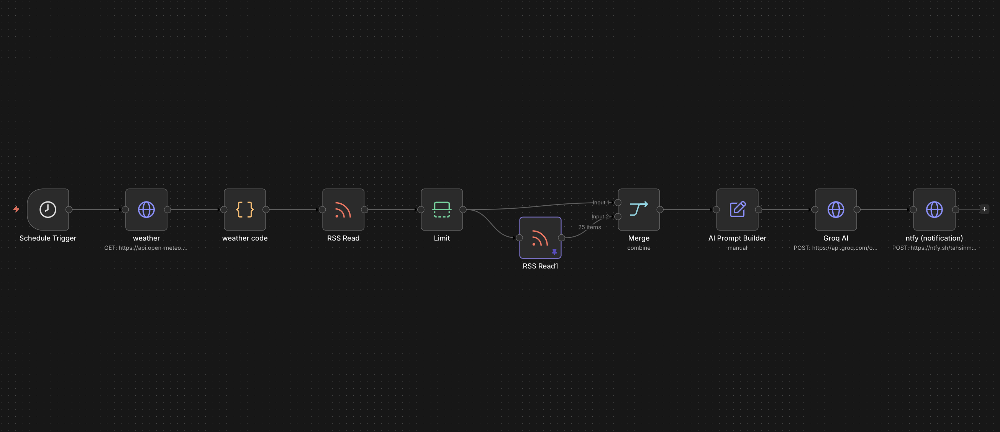

# AI Morning OS - Premium n8n Workflow Template

AI Morning OS is a production-ready n8n automation template that sends a concise daily executive briefing through ntfy. It combines Open-Meteo weather data, technology RSS news, career RSS opportunities, and a Groq-hosted AI model into one polished morning notification.

## Workflow Preview



## What This Automation Does

- Runs automatically on a configurable morning schedule.
- Validates buyer configuration before calling external services.
- Fetches current weather from Open-Meteo by latitude and longitude.
- Reads one technology RSS item and one career RSS item.
- Builds a premium AI briefing with practical context and a match score.
- Sends the final briefing to a private ntfy topic with title, tags, and priority.
- Handles empty feeds, partial API failures, and missing AI responses with clear fallback messages.

## Package Contents

- `workflow/ai-morning-os-template.json`: Import-ready n8n workflow.
- `docs/INSTALLATION.md`: Step-by-step setup guide for buyers.
- `docs/CONFIGURATION.md`: Every configurable field and recommended value.
- `docs/TROUBLESHOOTING.md`: Common issues, causes, and fixes.
- `docs/QUALITY_CHECKLIST.md`: Pre-delivery QA checklist.
- `docs/CUSTOMER_HANDOFF_NOTE.md`: Short note you can send to a buyer.
- `docs/MARKETPLACE_LISTING.md`: Sales listing copy for marketplaces.
- `tools/validate-package.mjs`: Local package validation script.
- `.env.example`: Optional self-hosted n8n environment template.
- `LICENSE`: Commercial use and redistribution terms.
- `LICENSE_TEMPLATE.txt`: Editable commercial license template.

## Quick Start

1. In n8n, choose **Import from File** and import `workflow/ai-morning-os-template.json`.
2. Open **USER CONFIG - EDIT ME**.
3. Replace the name, city, coordinates, RSS feeds, ntfy topic, and Groq API key.
4. Open **Schedule Trigger** and set the preferred run time.
5. Run the workflow manually once and confirm the ntfy notification arrives.
6. Activate the workflow only after a successful manual test.

## Buyer Requirements

- n8n Cloud or a self-hosted n8n instance.
- A Groq API key.
- The ntfy mobile app, desktop app, or web subscription to a private topic.
- RSS URLs for technology news and career opportunities.
- Latitude and longitude for the weather location.

## Security Note

This package does not include real API keys, personal ntfy topics, n8n instance identifiers, credentials, or execution data. Buyers must add their own API key and topic after import.

## Local Validation

Before delivery, run:

```bash
node tools/validate-package.mjs
```

The validator checks JSON syntax, workflow connection integrity, code node syntax, English-only package text, required files, and accidental secret leakage.
